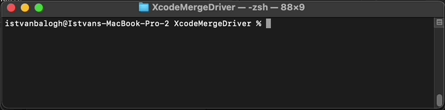

XcodeMergeDriver: Automatically resolve conflicts in your Xcode project files
=================================================
[](https://github.com/steven851007/XcodeMergeDriver/actions/workflows/swift.yml)

Table of contents
-----------------

* [Introduction](#introduction)
* [Installation](#installation)
* [Usage](#usage)
* [Known issues and limitations](#known-issues-and-limitations)
* [Getting help](#getting-help)
* [Contributing](#contributing)
* [License](#license)


Introduction
------------

Xcode Merge Driver is a tool that automatically resolves git conflicts in Xcode project files (.pbxproj). When a project has regular feature branch merges, these conflicts happen almost after every merge due to how Xcode manages the project file. Depending on the number of changes resolving these conflicts is not always straightforward, and it's a repetitive task. 

When a merge happens with a conflict, Xcode Merge Drive will launch and analyses the changes. First, it takes the changeset in the current branch compared to the base version. Then it takes the changset between the base branch and the other branch and merges these two changesets into one, respecting the logical structure of the project file. This merge strategy ensures that it resolves all conflicts correctly and generates a valid project file.


Installation
------------

Xcode Merge Driver is a git-merge-driver that git will call automatically when a conflict occurs in the .pbxproj file. For that, we have to integrate it with git. We can do this in three steps:

1: Download the latest version from the [Release page](https://github.com/steven851007/XcodeMergeDriver/releases) and put the XcodeMergeDriver executable into your project folder.

- Alternatively, check out the project and build it on your local machine

2: Define XcodeMergeDriver as a custom merge driver. We can do this in the .git/config file:

```gitconfig
[merge "XcodeMergeDriver"]
	name = Xcode .pbxproj project file merge driver
	driver = ./XcodeMergeDriver %A %O %B
```

The `merge` block contains the merge driver's identifier, used to reference the merge driver later.

The `name` variable gives the driver a human-readable name.

The `driver` variable is used to construct a command to run the merge driver. Our merge driver expects three parameters that it can pass to it:
- `%A`: the file name containing the **current** version
- `%O`: the file name containing the **common ancestor** (base) version
- `%B`: the file name containing the **other** version

The order of the parameters is important.
You can read more about how to define a custom merge driver in the [official documentation](https://git-scm.com/docs/gitattributes#_defining_a_custom_merge_driver)

3: Update the .gitattributes file

In the project .gitattributes file, we have to define to run this merge driver for the .pbxproj files:
```gitattributes
*.pbxproj merge=XcodeMergeDriver
```
 
Usage
-----

Git will run the merge driver automatically when a conflict occurs in the .pbxproj files: 



Xcode Merge Driver exits with code 0 if it successfully resolved the conflicts and with code 1 if the merge went awry. If a failure occurs, the script will leave all conflicts in the current version file, where you can resolve them manually. In case of success, the merged result will be in the file passed as the current version. 

Known issues and limitations
----------------------------

Currently, the driver can only resolve conflicts in the following sections in the project file:
- PBXBuildFile section
- PBXFileReference section
- PBXGroup section
- PBXSourcesBuildPhase section

Handling these sections cover the most common file operations that cause a conflict:
- Adding, deleting, moving renaming files
- Creating, deleting, moving and renaming groups

The script can't resolve conflicts caused by changes at other places in the Xcode project, like build configurations, schemes, etc. To support those pull requests are welcomed! See [Contributing](#contributing).


Getting help
------------

Please open a bug report describing the issue if you encounter a bug. Attaching the three files from the merge will help solve the bug much faster: 
- Current version
- Common ancestor version
- Other version


Contributing
------------

Contributions are welcomed! The project is written in Swift and thoroughly tested with multiple end-to-end tests. 
If you are fixing a bug or adding a new feature, add an end-to-end test case showcasing the problem and open a pull request with the fix.


License
-------

[MIT licensed.](LICENSE)
